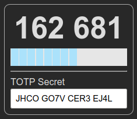

# TOTPDash
A simple Time-based One Time Password (TOTP) token generator web app using Plotly Dash.



Given a TOTP secret string, the application will generate a new six digit token every 30 seconds. The bar below the token indicates the remaining token validity time.

## Usage

### Online instance

An online instance is running at https://apps.urandom.xyz/totp.

### Execution from source

Install the requirements using pip:

```
$ pip install -r requirements.txt
```

Launch the application server:

```
$ python app.py
```

Access the application at the URL indicated in the terminal (usually http://127.0.0.1:8050).